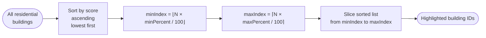

# Walkability Score — Technical Documentation

## Overview

The tool computes two related walkability metrics from the same underlying geometry:

| Metric | Scope | Where used |
|--------|-------|------------|
| **Per-building score** | One score (0–100) per residential building | Map highlight overlay, percentile filter |
| **City-wide score** | Single aggregate score (0–100) for the whole dataset | Insights panel |

Both metrics share the same scoring formula: a service is worth 100 points when it is co-located with the building and 0 points once the distance exceeds the empirically calibrated maximum walkable distance for that service type. The final score is the unweighted average across all enabled service types.

---

## Per-Building Score

### Calculation Flowchart

```mermaid
flowchart TD
    A([Start]) --> B[Load residential buildings\nand destination buildings]
    B --> C[Filter destinations to\nenabled land uses only]
    C --> D[Index destinations\nby land use type\nfor O(1) lookup]
    D --> E{For each\nresidential building}

    E --> F{For each\nenabled land use}
    F --> G[Get all destinations\nof this land use type]
    G --> H{Any destinations\nexist?}

    H -- No --> F
    H -- Yes --> I[Find nearest destination\nvia Haversine distance]
    I --> J[Record minDist\nfor this land use]
    J --> K["score_lu = max(0, 1 − minDist / maxWalkable) × 100"]
    K --> L[Add score_lu to\nrunning total]
    L --> F

    F -- All land uses done --> M["avgScore = round(totalScore / count)"]
    M --> N["Store BuildingWalkabilityScore\n{ buildingId, score: avgScore, serviceDistances }"]
    N --> E

    E -- All buildings done --> O([Return Map\nbuildingId → score])
```

### Source

**File:** `src/data/buildingWalkability.ts`  
**Function:** `calculateBuildingWalkability(residentialBuildings, destinations, enabledLandUses)`

```typescript
// Core scoring formula (line 75)
const ratio = Math.max(0, 1 - minDist / maxWalkable);
totalScore += ratio * 100;
```

```typescript
// Final score per building (line 81)
const avgScore = count > 0 ? Math.round(totalScore / count) : 0;
```

### Output Data Structure

```typescript
interface BuildingWalkabilityScore {
  buildingId: string;
  score: number;                          // 0–100, higher = better
  serviceDistances: Map<LandUse, number>; // metres to nearest service of each type
}
```

---

## City-Wide Score

**File:** `src/hooks/useUrbanInsights.ts`

Calculated on the same formula but uses **average trip distances** across all residential buildings (from the flow calculator) rather than per-building nearest distances. This gives a single headline figure for the Insights panel.

```typescript
const scores = serviceDistances.map(sd =>
  Math.max(0, 1 - sd.avgDistance / sd.maxWalkable) * 100
);
walkabilityScore = Math.round(scores.reduce((a, b) => a + b, 0) / scores.length);
```

---

## Scoring Formula

For a single service type at distance *d*:

```
score(d) = max(0,  1 − d / d_max)  ×  100
```

| Distance | Score |
|----------|-------|
| 0 m (co-located) | 100 |
| 0.5 × d_max | 50 |
| d_max | 0 |
| > d_max | 0 |

The relationship is **linear** — no exponent, no step function.

The **building score** is the arithmetic mean of `score(d)` across all enabled land use types for which at least one destination exists in the dataset.

---

## Maximum Walkable Distances (d_max)

Derived from the 95th percentile of pedestrian trip durations in **MiD 2023** (Mobilität in Deutschland — German national mobility survey), assuming walking speed 4.2 km/h (70 m/min).

**File:** `src/data/midMobilityData.ts` — `MID_MAX_DISTANCE`

| Service type | d_max (m) | Rationale |
|---|---|---|
| Sport Facility | 5 000 | Long recreational trips common (60+ min) |
| Culture | 4 000 | Occasional, willing to travel further |
| Entertainment | 3 000 | Leisure trips, moderate distance tolerance |
| Education | 3 000 | Regular but planned trips |
| Civic Function | 2 500 | Infrequent admin trips |
| Health & Wellbeing | 2 500 | Medium frequency, some urgency |
| Accommodation | 2 500 | Infrequent |
| Retail | 2 000 | Daily errand baseline |
| Food & Beverage | 2 000 | Daily errand baseline |
| Service | 2 000 | Daily errand baseline |
| Office Building | 2 000 | Default |
| Light Industrial | 2 000 | Default |
| Transport Service | 2 000 | Default |
| Utilities | 2 000 | Default |

---

## Score Categories

**File:** `src/components/panels/charts/WalkabilityScore.tsx`

| Score range | Label | Color |
|---|---|---|
| 80 – 100 | Excellent | Green |
| 60 – 79 | Good | Lime |
| 40 – 59 | Fair | Yellow |
| 20 – 39 | Poor | Orange |
| 0 – 19 | Very Poor | Red |

---

## Percentile-Based Filtering

**Files:**  
- `src/data/buildingWalkability.ts` — `getWalkabilityBuildingsInRange(scores, range)`  
- `src/context/FlowContext.tsx` — `getLowWalkabilityCount()`

The map overlay highlights buildings within a user-defined **percentile range** (not an absolute score range), so the selection count remains proportional to the dataset regardless of how scores are distributed.

### Flowchart



**Example:** with 1 000 residential buildings and range `[0, 20]`:

```
minIndex = ⌊1000 × 0 / 100⌋  = 0
maxIndex = ⌈1000 × 20 / 100⌉ = 200
→ 200 buildings with the lowest walkability scores are highlighted
```

---

## Initialisation Context

**File:** `src/context/FlowContext.tsx`

Walkability is calculated **once on startup**, before the user triggers any flow calculation, using all `DESTINATION_LAND_USES` enabled:

```typescript
const walkabilityScores = calculateBuildingWalkability(
  buildingStore.residential,
  buildingStore.destinations,
  new Set(DESTINATION_LAND_USES)   // all 14 service types
);
```

It is **not recalculated** when the user toggles land uses or transport modes — those controls affect only the trip flow model, not the static walkability overlay.

---

## Enabled Land Use Types

14 destination types contribute to walkability (Residential is excluded). Defined in `src/config/constants.ts` — `DESTINATION_LAND_USES`.

```
Retail · Food & Beverage · Entertainment · Service · Health & Wellbeing
Education · Office · Culture · Civic Function · Sport Facility
Light Industrial · Accommodation · Transport Service · Utilities
```

---

## Distance Measurement

Both the per-building and city-wide calculations use the **Haversine formula** (straight-line great-circle distance) implemented in `src/data/streetGraph.ts`. Street-network distance is not used for walkability; it is used only by the trip-flow path-finding component.

```
haversineDistance([lng1, lat1], [lng2, lat2]) → metres
```

---

## Key Design Decisions

| Decision | Rationale |
|---|---|
| Linear score decay | Simple, interpretable, matches linear trip-frequency decay in MiD data |
| Nearest-only distance | Reflects realistic behaviour: only the closest service of a type matters for daily access |
| Equal weight per service type | Avoids arbitrary weighting; each enabled type contributes equally |
| Percentile filter (not absolute) | Ensures consistent count of highlighted buildings across different cities/datasets |
| MiD 2023 calibration | Grounds max distances in observed German pedestrian trip distributions rather than arbitrary constants |
| Calculated once at startup | Walkability is a static land-use property; recomputing on every filter change would add unnecessary latency |
